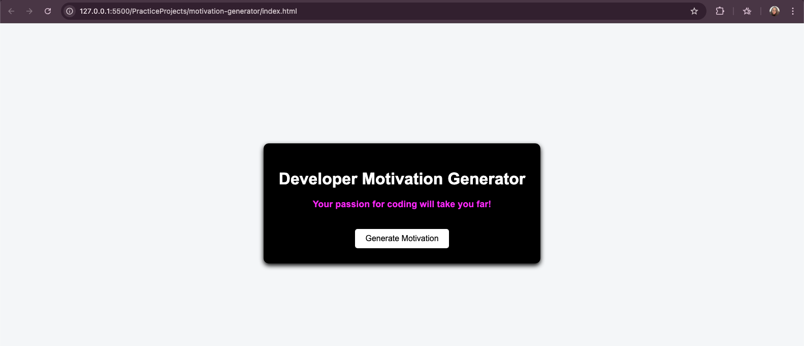

# Developer Motivation Generator

## 📌 Description
A JavaScript web application that generates motivational messages for developers. Each message displays with a unique color and appears without repetition until all messages have been shown.

## 🚀 Features
- Randomised message order using shuffle logic
- No repeated messages until full cycle completes
- Dynamic text and colour updates
- Interactive button-based UI

## 🛠️ Technologies Used
- HTML
- CSS
- JavaScript

## 💡 What I Learned
- How to manipulate the DOM using JavaScript
- Working with arrays and objects
- Handling events with addEventListener
- Implementing logic to avoid repetition
- Debugging and fixing real issues
- Using Git and GitHub to version control and publish projects

## 📸 Screenshot

## 🌍 Live Demo
(Will be added after deployment)